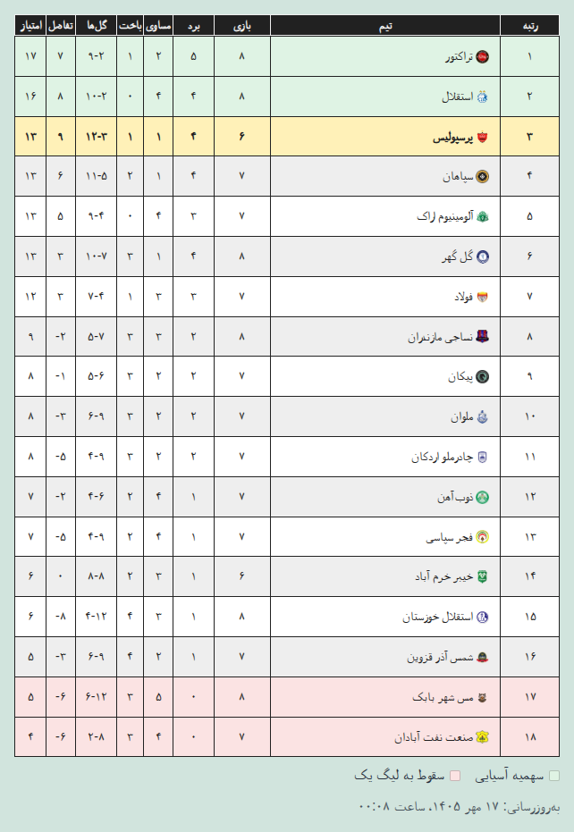
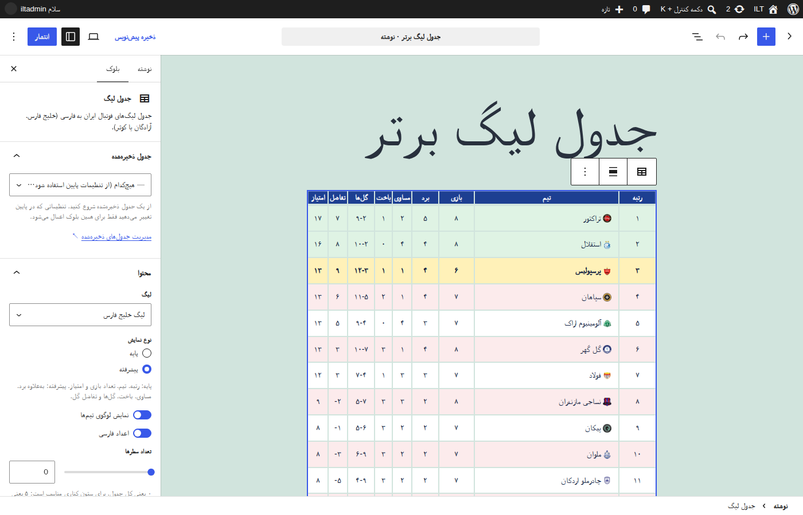
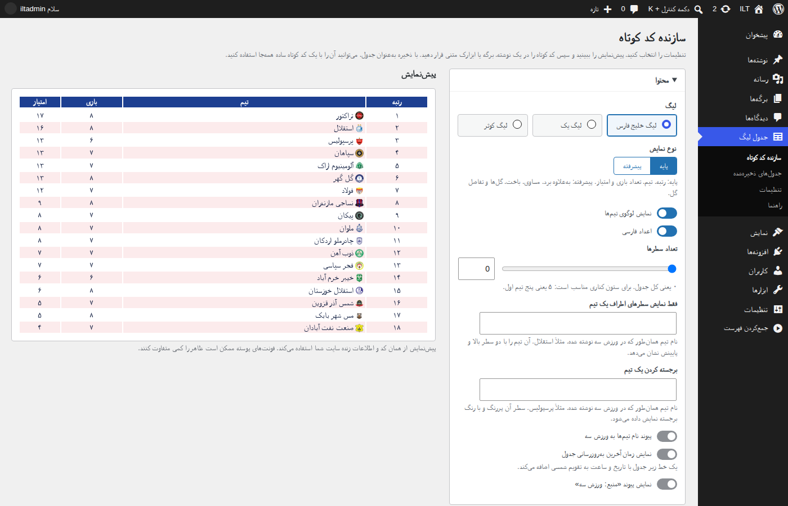

# جدول لیگ ایران
[](https://github.com/LordArma/Iranian-League-Table)
[](https://github.com/LordArma/Iranian-League-Table/blob/master/README.fa.md)

افزونه وردپرس که به سایت‌های وردپرسی کمک می‌کند جدول لیگ برتر ایران (لیگ خلیج فارس) یا لیگ یک ایران (لیگ آزادگان) را به صورت ویجت یا شورتکد به فارسی نمایش دهند.

جدول‌ها به زبان فارسی نمایش داده می‌شوند و می‌توان آنها را در رنگ، نوع و اندازه‌های گوناگون سفارشی کرد تا با محل نمایش آنها مطابقت داشته باشد.

اطلاعات جدول‌ها در حال حاضر از سایت  [ورزش ۳](https://www.varzesh3.com/developer-tools) گرفته می‌شود.



## دانلود
شما می‌توانید آخرین نسخه را از  [اینجا](https://github.com/LordArma/Iranian-League-Table/releases) دریافت کنید.

## شیوه استفاده
به چهار شکل می‌توانید از این افزونه استفاده کنید:
- **بلوک جدول لیگ** (ساده‌ترین راه، پیشنهادی)
- سازنده کد کوتاه
- به عنوان ابزارک
- به عنوان شورتکد

### بلوک جدول لیگ (پیشنهادی)
از نسخه ۴٫۲ جدول مستقیماً در ویرایشگر بلوک کار می‌کند و حالا ساده‌ترین راه اضافه کردن آن همین است. در یک نوشته یا برگه
روی **+** بزنید و بلوک **جدول لیگ** را اضافه کنید. یک جدول ذخیره‌شده انتخاب کنید یا لیگ، نوع نمایش، رنگ‌ها و اندازه‌ها را
در نوار کناری بلوک تنظیم کنید؛ ویرایشگر همان جدول واقعی را نشان می‌دهد و اصلاً نیازی به کد کوتاه نیست.
این بلوک در ابزارک‌های بلوکی هم کار می‌کند. بلوک کد کوتاه یا کد کوتاه `[iran_league ...]` که در ویرایشگر قرار داده شود
را می‌توان به این بلوک تبدیل کرد.



### سازنده کد کوتاه
برای ویرایشگر کلاسیک، ابزارک‌های کلاسیک یا صفحه‌سازها، در پیشخوان وردپرس به **جدول لیگ ← سازنده کد کوتاه** بروید. لیگ،
نوع نمایش، رنگ‌ها (یا یکی از قالب‌های رنگی آماده) و اندازه‌ها را انتخاب کنید، پیش‌نمایش زنده را ببینید و با
**کپی کد کوتاه** آن را در هر نوشته، برگه یا ابزارکی قرار دهید.
با **ذخیره به‌عنوان جدول** یک کد کوتاه ساده مثل `[iran_league id="12"]` می‌گیرید؛ هر وقت جدول ذخیره‌شده را تغییر دهید،
همه صفحه‌هایی که از آن استفاده می‌کنند یک‌جا به‌روز می‌شوند. در ویرایشگر کلاسیک، دکمه **جدول لیگ** بالای ویرایشگر
سازنده را باز می‌کند و کد کوتاه را خودش اضافه می‌کند.



### جدول لیگ ایران به عنوان ابزارک
اگر قالب وردپرس شما از ویجت‌های قدیمی پشتیبانی می‌کند، می‌توانید به راحتی از قسمت ابزارک‌های وردپرس جدول مورد نظر خود را در جای مناسب قرار دهید و سپس گزینه‌های آن را تنظیم کنید.

### جدول لیگ ایران به عنوان شورتکد
این روش در تمامی نسخه‌های وردپرس به درستی کار می‌کند. تنها کاری که باید انجام دهید این است که شورتکد این افزونه را به همراه پارامترهای مورد نظر خود در قسمت قرار دادن شورت کد مانند بلوک‌های وردپرس در صفحات و پست‌های سایت وردپرسی خود قرار دهید.

### چند مثال از شیوه استفاده
‌نمایش مدل پایه جدول لیگ برتر ایران (خلیج فارس)
```
[iran_league league="persiangulf" mode="basic"]
```

نمایش پیشرفته جدول لیگ یک ایران (آزادگان)
```
[iran_league league="azadegan" mode="advanced"]
```

‌نمایش مدل پایه جدول لیگ برتر ایران بدون لوگوی تیم‌ها
```
[iran_league league="persiangulf" mode="basic" logo="false"]
```

نمایش مدل پایه جدول لیگ برتر ایران بدون لوگوی تیم‌ها با اعداد فارسی
```
[iran_league league="persiangulf" mode="basic" logo="false" farsi_numbers="true"]
```

نمایش مدل پایه لیگ زنان ایران (کوثر) بدون لوگو
```
[iran_league league="kowsar" mode="basic" logo="false"]
```

نمایش جدول لیگ برتر ایران با رنگ و اندازه دلخواه
```
[iran_league league="bartar" mode="advanced" title_backcolor="#212121" title_color="#ffffff" text_color="#212121" odd_color="#ffffff" even_color="#eeeeee" logo_size="15" logo="true" title_font="12" text_font="13" farsi_numbers="false"]
```

## تنظیمات بیشتر
| ویژگی | نمونه | کاربرد |
|---|---|---|
| `rows` | `rows="5"` | فقط N سطر اول (۰ یعنی کل جدول) |
| `around` | `around="استقلال"` | نمایش یک تیم با دو سطر بالا و پایینش |
| `highlight` | `highlight="پرسپولیس"` | پررنگ کردن سطر یک تیم |
| `highlight_top` / `highlight_bottom` | `highlight_top="2" highlight_bottom="2"` | رنگ‌آمیزی سطرهای بالا و پایین جدول همراه با راهنما |
| `team_links` | `team_links="true"` | پیوند نام تیم‌ها به صفحه‌شان در ورزش سه |
| `show_updated` / `show_source` | `show_updated="true"` | نمایش زمان به‌روزرسانی (تاریخ شمسی) / پیوند «منبع: ورزش سه» |
| `dark_mode` | `dark_mode="true"` | رنگ‌های تیره وقتی دستگاه بازدیدکننده در حالت تیره است |
| `id` | `id="12"` | استفاده از یک جدول ذخیره‌شده |

فهرست کامل ویژگی‌ها و مقدارهای پیش‌فرض در پیشخوان، بخش **جدول لیگ ← راهنما** آمده است.

## قالب‌های رنگی آماده
در سازنده کد کوتاه، بلوک و ابزارک می‌توانید با یک انتخاب هر پنج رنگ جدول را پر کنید:
کلاسیک (پیش‌فرض)، روشن، تیره، آبی خلیج فارس، آبی استقلال، قرمز پرسپولیس، داماش (آبی و قرمز) و خاکستری ساده.
برنامه‌نویس‌ها می‌توانند با فیلتر `ilt_presets` قالب خودشان را اضافه کنند.

## تنظیمات
در **جدول لیگ ← تنظیمات** (فقط مدیران):
- **فاصله به‌روزرسانی:** هر چند وقت یک بار اطلاعات جدول در پس‌زمینه گرفته شود (پیش‌فرض ۵ دقیقه)، همراه با دکمه
  **به‌روزرسانی اکنون** و وضعیت اطلاعات هر لیگ.
- **داده‌های ساختاریافته:** اطلاعات schema.org (لیگ و تیم‌ها) را به صفحه‌هایی که جدول دارند اضافه می‌کند تا موتورهای
  جستجو جدول را بهتر بفهمند. به‌طور پیش‌فرض روشن است؛ برای خاموش کردن، تیک آن را بردارید.

## توضیحات بیشتر به زبان فارسی
در وبلاگم مطلبی با عنوان [پلاگین وردپرس جدول لیگ برتر و لیگ یک فوتبال ایران](https://lordarma.com/iranian-league-table/) منتشر کردم. در صورت تمایل می‌توانید [این مطلب](https://lordarma.com/iranian-league-table/) را هم برای آشنایی بیشتر با این افزونه مطالعه کنید.
