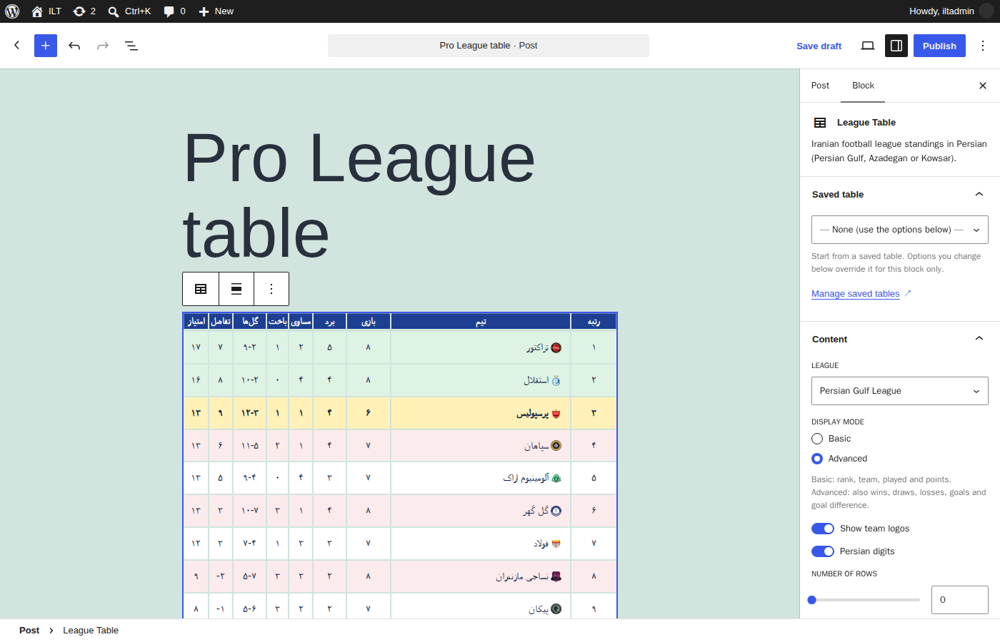
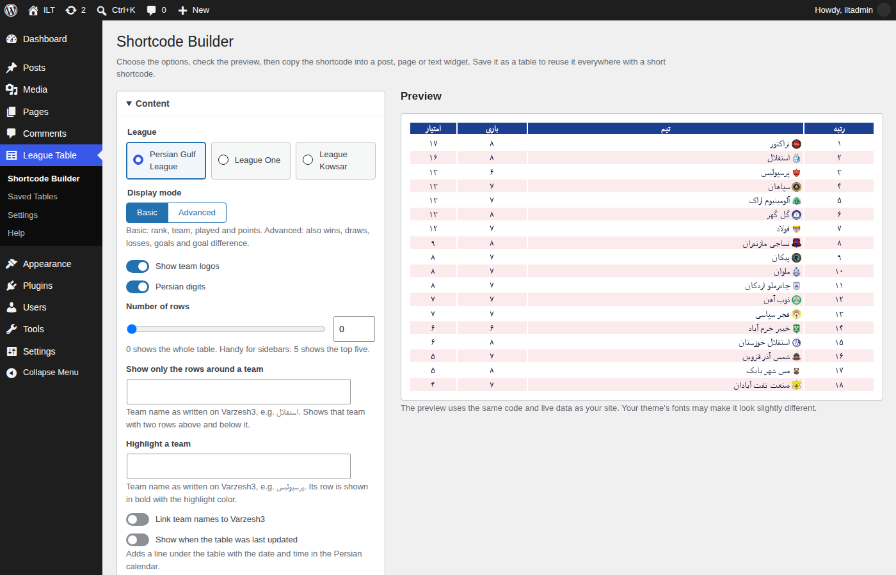

# Iranian League Table
[](https://github.com/LordArma/Iranian-League-Table)
[](https://github.com/LordArma/Iranian-League-Table/blob/master/README.fa.md)

A WordPress plugin that helps WordPress sites display the Iranian Premier League (Persian Gulf League) or the Iranian League One (Azadegan League) table in Persian as a widget or shortcode.

The tables are displayed in Farsi and can be customized in color and display type to match their display location.

These tables data are provided by the [Varzesh3](https://www.varzesh3.com/developer-tools) website.


## Download
You can download the last version from: [here](https://github.com/LordArma/Iranian-League-Table/releases).

## How to use?
You can use this plugin in four ways:
- **The League Table block** (easiest, recommended)
- The Shortcode Builder
- As a Widget
- As a Shortcode

### Use the League Table block (recommended)
Since version 4.2 the table works directly in the block editor, and this is now the easiest way to add it. In a post or
page, click **+** and add the **League Table** block. Choose a saved table or set the league, mode, colors and sizes in
the block sidebar; the editor shows the real table while you work, and you don't need a shortcode at all.
The block also works in block-based widget areas. An existing Shortcode block or pasted `[iran_league ...]` shortcode
can be converted to the block.



### Shortcode Builder
For the classic editor, classic widgets or page builders, open **League Table → Shortcode Builder** in the WordPress
admin. Pick the league, display mode, colors (or a ready-made preset) and sizes, watch the live preview, then click
**Copy shortcode** and paste it into any post, page or widget.
Click **Save as table** to get a short shortcode such as `[iran_league id="12"]`: when you change a saved table later,
every page that uses it updates at once. In the classic editor, the **League Table** button above the editor opens the
Builder and inserts the shortcode for you.



### Use Iranian League Table as a Widget
If your WordPress theme supports legacy widgets, you can easily place your desired table in the appropriate place from the WordPress widgets section and then set its options.

### Use Iranian League Table as a Shortcode
This method works correctly in all versions of WordPress. All you need to do is place the shortcode of this plugin along with your desired parameters in the shortcode placement area, such as WordPress blocks, on your WordPress site pages and posts.

### Example of Using Shortcode
‌Basic display of the Iranian Premier League (Persian Gulf) table
```
[iran_league league="persiangulf" mode="basic"]
```

Advanced display of the Iranian League One (Azadegan) table
```
[iran_league league="azadegan" mode="advanced"]
```

‌Basic display of the Iranian Premier League table without team logos
```
[iran_league league="persiangulf" mode="basic" logo="false"]
```

‌Basic display of the Iranian Premier League table without team logos and Farsi numbers
```
[iran_league league="persiangulf" mode="basic" logo="false" farsi_numbers="true"]
```

‌Basic display of the Iranian Women's League (Kowsar) without logo
```
[iran_league league="kowsar" mode="basic" logo="false"]
```

Display the Iranian Premier League table with the desired color and size
```
[iran_league league="bartar" mode="advanced" title_backcolor="#212121" title_color="#ffffff" text_color="#212121" odd_color="#ffffff" even_color="#eeeeee" logo_size="15" logo="true" title_font="12" text_font="13" farsi_numbers="false"]
```

## More options
| Attribute | Example | What it does |
|---|---|---|
| `rows` | `rows="5"` | Show only the first N rows (0 = all) |
| `around` | `around="استقلال"` | Show a team with two rows above and below it |
| `highlight` | `highlight="پرسپولیس"` | Bold the team's row with `highlight_color` |
| `highlight_top` / `highlight_bottom` | `highlight_top="2" highlight_bottom="2"` | Color the top/bottom rows (`top_color`, `bottom_color`) and add a legend (`top_label`, `bottom_label`) |
| `team_links` | `team_links="true"` | Link team names to their Varzesh3 pages |
| `show_updated` / `show_source` | `show_updated="true"` | Footer with the last update (Persian calendar) / a "Source: Varzesh3" link |
| `dark_mode` | `dark_mode="true"` | Switch to dark colors when the visitor's device is in dark mode |
| `id` | `id="12"` | Use a saved table (other attributes override it) |

The Help page in the admin (League Table → Help) lists every attribute with its default.

## Color presets
The Shortcode Builder, the block and the widget offer ready-made color sets that fill all five colors at once:
Classic (default), Light, Dark, Persian Gulf blue, Esteghlal blue, Persepolis red, Damash (blue and red) and Neutral gray.
Developers can add their own with the `ilt_presets` filter.

## Settings
**League Table → Settings** (administrators only):
- **Refresh interval:** how often the standings are fetched in the background (default 5 minutes), plus a
  **Refresh now** button and the data status of each league.
- **Structured data:** adds schema.org JSON-LD (the league and its teams) to pages that show a table, to help search
  engines. On by default; untick it to turn it off.

## For developers
- **Template override:** copy `templates/table.php` to `your-theme/iranian-league-table/table.php`.
- **CSS custom properties** on `.ilt`: `--ilt-head-bg`, `--ilt-head-fg`, `--ilt-text`, `--ilt-odd`, `--ilt-even`,
  `--ilt-top`, `--ilt-bottom`, `--ilt-highlight`, `--ilt-logo-size`, `--ilt-head-font`, `--ilt-body-font`.
- **Filters**
  - `ilt_leagues`: add or change leagues (slug → `id`, `label`, `aliases`, optional `top_label`/`bottom_label`)
  - `ilt_presets`: Builder color presets
  - `ilt_cache_ttl`: cache lifetime in seconds
  - `ilt_fetched_data`, `ilt_table_data`: change the decoded standings after fetching / before rendering
  - `ilt_table_html`: change the final HTML
  - `ilt_shortcode_base_values`: values a shortcode starts from (saved tables hook in here)

Example: add the English Premier League (Varzesh3 league id 1):
```php
add_filter( 'ilt_leagues', function ( $leagues ) {
	$leagues['premier'] = array( 'id' => 1, 'label' => 'Premier League', 'aliases' => array( 'premier', 'epl' ) );
	return $leagues;
} );
```
